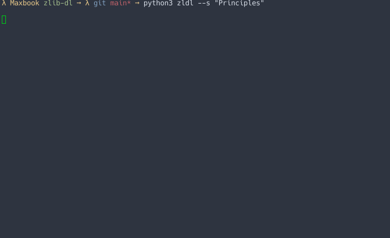

# zlib-dl
Python tool allowing easy books downloads from the terminal 



## Features 
- Bypass z-library's randomly generated links to downloads
- Obtain a specified number of results

## Installation
Clone the repository and install dependencies
```
git clone https://github.com/Nquxii/zlib-dl
cd zlib-dl
```
```
pip install -r requirements.txt
```

Open help section
```
python3 zldl --h
```
## Usage
```
python3 zldl [path] --s [query] --n [number of results] --p [number of pages]
```
Number of results defaults to all results available, which may not be relevant, so it is recommended to use a small value for --n, like 5.

Number of pages is only necessary for larger searches (> 50 results) and is not recommended for usability purposes.


If a path in the command is specified, it will be used. Otherwise, the download_path in config.json will be used.
If none of these options are available, the program will use ./assets/ as its download folder.

### Example
View 5 search results for "The Pragmatic Programmer". Download the resulting file in /home/johndoe/Documents/books
```
python3 zldl /home/johndoe/Documents/books --s "The Pragmatic Programmer" --n 5
```
